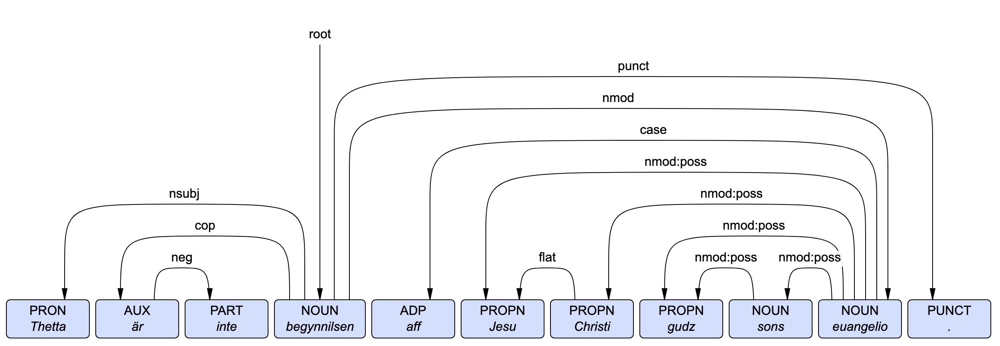

# GPT CoNLL-U
Prompt engineering GPTs for UD-style parsing of pre-modern Swedish.
Part of the group research project ``Diachronic Treebanks`` of DigPhil.

Task division inspired by [Matsuda 2025](media/Matsuda-2025-LLM-dependency-parsing.pdf), but using one prompt per task instead of chain-of-thought. 
To minimize risk of hallucination, the gpt uses placeholders for tabs, 
and the actual ten tab `.conllu` is made programmatically once all tasks are done. There are five tasks, with the first task being longer (like Matsuda) and the following each adding one field. To make life easier for the model, we exclude `XPOS` and `MISC` and automatically map them to `_` afterwards.

With the current task prompt, the cheapest model `gpt-5-nano`
is not able to come up with `FEAT`, but `gpt-5-mini` is (for reproducibility we specifically use the snapshot `gpt-5-mini-2025-08-07`).

For example, input `"Thetta är inte begynnilsen aff Jesu Christi gudz sons euangelio."` (the first sentence of the 1526 gospel of Mark with an added negation) results in the following tree, which at least at first glance looks acceptable for our purposes:



```
ID	FORM	LEMMА	UPOS	XPOS	FEATS	HEAD	DEPREL	DEPS	MISC

1	Thetta	thetta	PRON	_	Case=Nom|Gender=Neut|Number=Sing|PronType=Dem	4	nsubj	4:nsubj	_
2	är	vara	AUX	_	Mood=Ind|Number=Sing|Person=3|Tense=Pres|VerbForm=Fin	4	cop	4:cop	_
3	inte	inte	PART	_	Polarity=Neg	2	neg	2:neg	_
4	begynnilsen	begynnilsen	NOUN	_	Case=Nom|Definite=Def|Gender=Com|Number=Sing	0	root	0:root	_
5	aff	aff	ADP	_	AdpType=Prep	10	case	10:case	_
6	Jesu	Jesu	PROPN	_	Case=Gen|Gender=Masc|Number=Sing	7	flat	7:flat|10:nmod:poss	_
7	Christi	Christi	PROPN	_	Case=Gen|Gender=Masc|Number=Sing	10	nmod:poss	10:nmod:poss	_
8	gudz	gudz	PROPN	_	Case=Gen|Gender=Masc|Number=Sing	9	nmod:poss	9:nmod:poss|10:nmod:poss	_
9	sons	sons	NOUN	_	Case=Gen|Gender=Masc|Number=Sing	10	nmod:poss	10:nmod:poss	_
10	euangelio	euangelio	NOUN	_	Case=Nom|Gender=Neut|Number=Sing	4	nmod	4:nmod	_
11	.	.	PUNCT	_	_	4	punct	4:punct	_
```

See [the main notebook](main.ipynb) for instructions and examples of running the pipeline on your texts of choice.